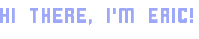

<a href="https://ericjen01.github.io"> </a>

**About me**

I'm a self-taught FrontEnd developer living in Vancouver. There are countless of talented people around the world sharing their creativities and inspirations in webdev and I am really grateful for being able to learn from the community. My passion for webdev lies with turning ideas into elegant interfaces through various languages and tools. I seek to learn continuously to improve thearchitecture and quality of the things I build.

- 👍 I am conversed with: Basic static website development
- 👨🏽‍💻 I’m currently learning: Vue & React etac 
- 🎯 My goal: continue to sharpen my skills in webdev
- 📮 Reach me at ---> *under construction*

<!---
ericjen01/ericjen01 is a ✨ special ✨ repository because its `README.md` (this file) appears on your GitHub profile.
You can click the Preview link to take a look at your changes.
--->
